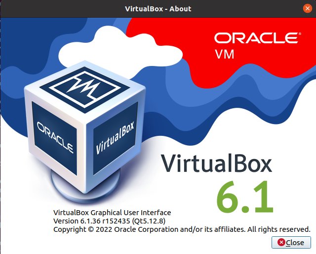
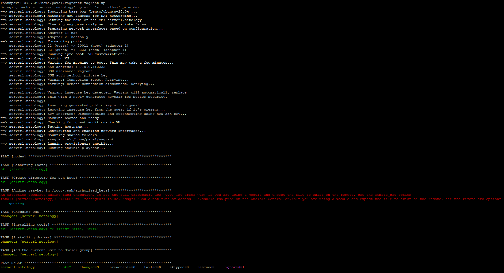
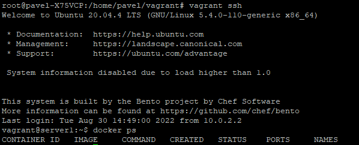

# Домашнее задание к занятию "5.2. Применение принципов IaaC в работе с виртуальными машинами"
1. Основные преимущества приминения IaaC:
   1. Ускорение процесса развёртывания инфраструктуры для проекта.
   2. Обеспечение идентичности различных сред развёрнутых при помощи одних и техже конфигурационных файлов.  

   Основопологающим принципом IaaC является **идемпотентность** - когда при выполнении одной и той-же операции мы всегда получаем один и тот-же результат.
2. На мой взгляд Ansible отличается отсутсвием необходимости установки дополнительного ПО на управляемые машины. Достаточно только SSH который по умолчанию установлен и включен в большинстве дистрибутивов Linux.  
   На мой взгляд метод pull более надёжный т.к. управляемая системой машина сама регулярно запрашивает с сервера новую конфигурацию, таким образом если она была выключена или была не в сети во время создания новой конфигурации, она всёравно её получит когда включится или окажется в сети. Но у обоих методов есть свои способы применения в которых они более эффективны.
3. Приложения установлены:  
  
  
4. Машина создана:  
  
Docker установлен:  
